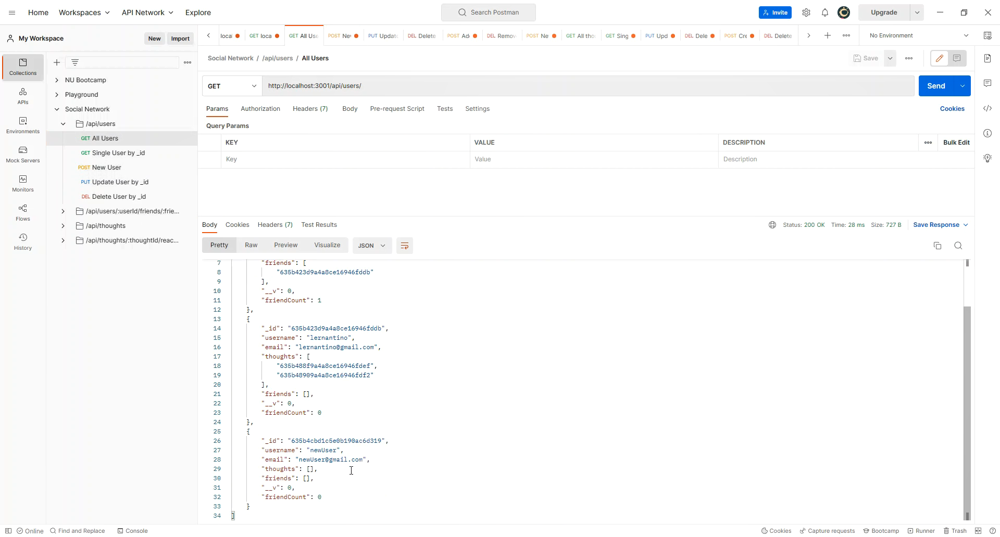
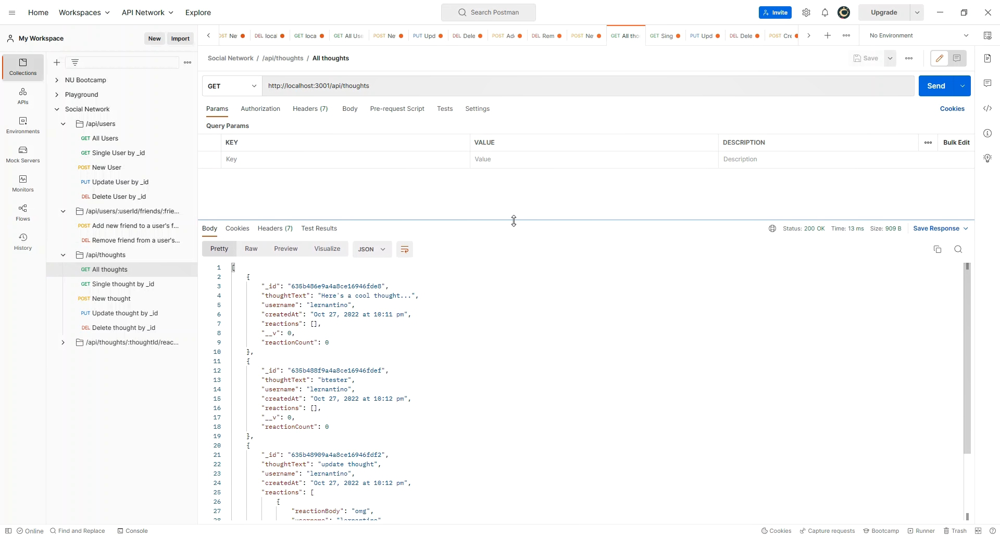
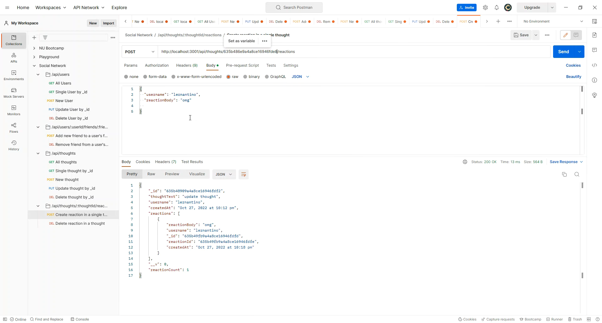

# NoSQL: Social Network API

  ## Description
  
This is an API for a social network web application where users can share their thoughts, react to friends’ thoughts, and create a friend list. This app will use Express.js for routing, a MongoDB database, and the Mongoose ODM. 

  ## User Story

    ```
    AS A social media startup
    I WANT an API for my social network that uses a NoSQL database
    SO THAT my website can handle large amounts of unstructured data
    ```


  ## Acceptance Criteria

    ```md
    GIVEN a social network API
    WHEN I enter the command to invoke the application
    THEN my server is started and the Mongoose models are synced to the MongoDB database
    WHEN I open API GET routes in Postman for users and thoughts
    THEN the data for each of these routes is displayed in a formatted JSON
    WHEN I test API POST, PUT, and DELETE routes in Postman
    THEN I am able to successfully create, update, and delete users and thoughts in my database
    WHEN I test API POST and DELETE routes in Postman
    THEN I am able to successfully create and delete reactions to thoughts and add and remove friends to a user’s friend list
    ```
  
  ## Table of Contents 
  
  - [Installation](#installation)
  - [Usage](#usage)
  - [License](#license)
  - [Contributing](#contributing)
  - [Tests](#tests)
  - [Questions](#questions)
  
  ## [Installation](#table-of-contents)
  
  Download or clone the repo on your local machine to run it. You will need Node.js and MongoDB to run this app.
  
  ## [Usage](#table-of-contents)
  
  Start the server using npm start.
  Connect to the MongoDB URI mongodb://localhost:27017
  Connect to the API routes using either Postman or Insomnia.

  USER

  Create a new user: POST /api/users | include username & email
  Get all users: GET /api/users
  Get a single user by its id: GET /api/users/:userId
  Update a user by its id: PUT /api/users/:userId
  Delete a user by its id: DELETE /api/user/:userId

  

  FRIEND

  Add a new friend to a user's friend list: POST /api/users/:userid/friends/:friendId
  Delete a friend from a user's friend list: DELETE /api/users/:userid/friends/:friendId
  
  

  THOUGHT

  Create a new thought: POST /api/thoughts/ | include thoughtText
  Get all thoughts: GET /api/thoughts/
  Get a single thought by its id: GET /api/thoughts/:thoughtId
  Update a thought by its id: PUT /api/thoughts/:thoughtId
  Delete a thought by its id: DELETE /api/thoughts/:thoughtId

  
  
  REACTION

  Create a reaction: POST /api/thoughts/:thoughtId/reactions
  Delete a reaction by the reactionId: DEL /api/thoughts/:thoughtId/reactions/:reactionId

  

  Media:

  Here's a video of the app in action: [Video Link](https://drive.google.com/file/d/1kXMSTMYoUeQmQfWj3Bq8n2ANL79fEIlt/view?usp=sharing).
  
  ## [License](#table-of-contents)

  License Used: MIT
 
  ## [Contributing](#table-of-contents)
  
  Not open for contributions.

  ## [Tests](#table-of-contents)
  
  N/A
  
  ## [Questions](#table-of-contents)
  
  For additional questions, please reach out to:

  [GitHub: devilarms83](https://github.com/devilarms83)

  [Email: bautista.albert@gmail.com](mailto:bautista.albert@gmail.com)

